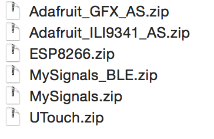

## How to use MySignals HW BLE with Unity 3d Short instruction for MAC OSX
1. Go to this page 
2. Install [Arduino IDE](https://www.arduino.cc/en/Main/Software)
3. Download [arduino library](http://www.cooking-hacks.com/media/cooking/images/documentation/mysignals_hardware/MySignals_HW_SDK_V2.0.0.zip). If this link broken you can download latest version here [MySignals Hardware SDK](https://www.cooking-hacks.com/mysignals-hw-ehealth-medical-biometric-iot-platform-arduino-tutorial/#step5)
4. 
